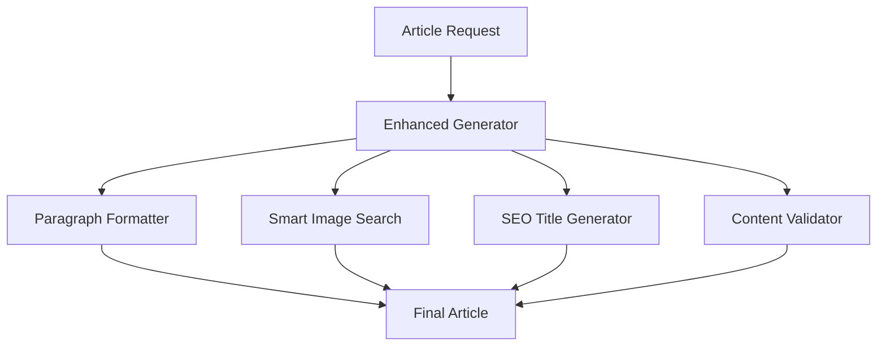

# Design Document

## Overview

تصميم نظام محسّن لتوليد المقالات يركز على: جودة الفقرات، دقة الصور، تنوع العناوين، ومنع قطع المقالات.

## Architecture



## Components and Interfaces

### 1. Enhanced Paragraph Formatter

- تنسيق الفقرات (3-6 جمل لكل فقرة)
- التحقق من عدم تجاوز 150 كلمة
- إضافة تباعد مناسب

### 2. Smart Image Search Engine

- استخراج كلمات مفتاحية خاصة بالموضوع
- قاموس موسّع للترجمة حسب الفئة
- أولوية للصور المطابقة للموضوع

### 3. Diverse SEO Title Generator

- 50+ نمط عنوان
- تتبع الأنماط المستخدمة
- منع التكرار خلال 30 يوم

### 4. Content Validator

- التحقق من اكتمال الخاتمة
- التحقق من إغلاق HTML tags
- التحقق من عدد الكلمات

## Data Models

```typescript
interface TitlePattern {
  id: string;
  pattern: string;
  category: string;
  lastUsed: Date | null;
}

interface ImageSearchContext {
  topic: string;
  category: string;
  specificKeywords: string[];
  fallbackKeywords: string[];
}
```

## Correctness Properties

_A property is a characteristic or behavior that should hold true across all valid executions of a system._

Property 1: Paragraph length consistency
_For any_ generated paragraph, the word count should be between 30 and 150 words
**Validates: Requirements 1.3**

Property 2: Image relevance
_For any_ article topic, the selected images should contain keywords from the topic
**Validates: Requirements 2.1, 2.5**

Property 3: Title uniqueness
_For any_ two consecutive articles in the same category, the title patterns should be different
**Validates: Requirements 3.3, 3.4**

Property 4: Article completeness
_For any_ generated article, it should end with a proper conclusion containing at least 2 sentences
**Validates: Requirements 4.1, 4.2**

## Error Handling

- Fallback للصور العامة إذا لم تتوفر صور خاصة
- إعادة توليد الخاتمة إذا كانت مقطوعة
- استخدام نمط عنوان عشوائي إذا استُنفدت الأنماط

## Testing Strategy

- Unit tests للتحقق من تنسيق الفقرات
- Integration tests للتحقق من البحث عن الصور
- Property tests للتحقق من تنوع العناوين
