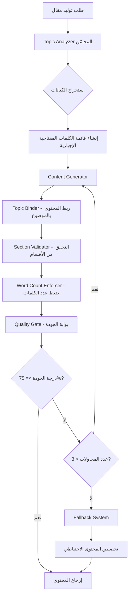

# Design Document

## Overview

هذا التصميم يهدف لإصلاح مشاكل جودة توليد المقالات بشكل جذري من خلال:

1. **Topic Binder** - مكون جديد يضمن ربط كل جزء من المحتوى بالموضوع
2. **Strict Quality Gate** - بوابة جودة صارمة ترفض المحتوى الرديء
3. **Fallback System** - نظام محتوى احتياطي مضمون الجودة
4. **Enhanced Topic Analyzer** - محلل موضوع محسّن يستخرج الكيانات بدقة

## Architecture



## Components and Interfaces

### 1. TopicBinder (مكون جديد)

```typescript
interface TopicBinderConfig {
  topic: string;
  requiredKeywords: string[];
  entities: ExtractedEntities;
  maxWordsWithoutMention: number; // الحد الأقصى للكلمات بدون ذكر الموضوع
}

interface TopicBinderResult {
  boundContent: string;
  topicMentionCount: number;
  bindingScore: number; // 0-100
}

class TopicBinder {
  bind(content: string, config: TopicBinderConfig): TopicBinderResult;
  bindIntro(intro: string, config: TopicBinderConfig): string;
  bindSection(section: string, config: TopicBinderConfig): string;
  bindConclusion(conclusion: string, config: TopicBinderConfig): string;
  calculateBindingScore(content: string, config: TopicBinderConfig): number;
}
```

### 2. StrictQualityGate (بوابة الجودة الصارمة)

```typescript
interface QualityGateConfig {
  minTopicRelevance: number; // 80%
  minOverallScore: number; // 75%
  requiredKeywords: string[];
  requiredSections: string[];
  wordCountLimits: { min: number; max: number };
}

interface QualityGateResult {
  passed: boolean;
  topicRelevanceScore: number;
  overallScore: number;
  missingKeywords: string[];
  missingSections: string[];
  wordCountStatus: 'below' | 'within' | 'above';
  rejectionReasons: string[];
}

class StrictQualityGate {
  validate(content: string, config: QualityGateConfig): QualityGateResult;
  checkTopicRelevance(content: string, keywords: string[]): number;
  checkRequiredSections(content: string, sections: string[]): string[];
  checkWordCount(content: string, limits: { min: number; max: number }): string;
}
```

### 3. FallbackContentSystem (نظام المحتوى الاحتياطي)

```typescript
interface FallbackTemplate {
  category: TopicCategory;
  template: string;
  placeholders: string[]; // {name}, {age}, {topic}, {zodiac}
}

interface FallbackResult {
  content: string;
  isFallback: boolean;
  warning: string;
  originalError?: string;
}

class FallbackContentSystem {
  getTemplate(category: TopicCategory): FallbackTemplate;
  customize(template: FallbackTemplate, entities: ExtractedEntities): string;
  generate(topic: string, entities: ExtractedEntities): FallbackResult;
}
```

### 4. EnhancedContentGenerator (المولد المحسّن)

```typescript
interface GenerationConfig {
  topic: string;
  length: ArticleLength;
  maxRetries: number;
  strictMode: boolean; // وضع صارم - لا يقبل محتوى رديء
}

interface GenerationResult {
  content: string;
  title: string;
  metaDescription: string;
  keywords: string[];
  qualityReport: QualityGateResult;
  attempts: number;
  isFallback: boolean;
  warnings: string[];
}

class EnhancedContentGenerator {
  generate(config: GenerationConfig): Promise<GenerationResult>;
  private generateWithRetry(
    config: GenerationConfig
  ): Promise<GenerationResult>;
  private applyTopicBinding(content: string, config: TopicBinderConfig): string;
  private validateAndRetry(content: string, config: QualityGateConfig): string;
}
```

## Data Models

### Word Count Limits (محدّثة)

```typescript
const STRICT_WORD_COUNT_LIMITS: Record<
  ArticleLength,
  { min: number; max: number; target: number }
> = {
  short: { min: 450, max: 550, target: 500 },
  medium: { min: 900, max: 1100, target: 1000 },
  long: { min: 1800, max: 2200, target: 2000 },
  comprehensive: { min: 2800, max: 3500, target: 3000 },
};
```

### Required Sections (محدّثة)

```typescript
const STRICT_REQUIRED_SECTIONS: Record<ArticleLength, RequiredSections> = {
  short: {
    intro: true,
    minH2Sections: 3,
    faq: false,
    tips: false,
    conclusion: true,
  },
  medium: {
    intro: true,
    minH2Sections: 4,
    faq: false,
    tips: true,
    conclusion: true,
  },
  long: {
    intro: true,
    minH2Sections: 5,
    faq: true,
    tips: true,
    conclusion: true,
  },
  comprehensive: {
    intro: true,
    minH2Sections: 6,
    faq: true,
    tips: true,
    conclusion: true,
  },
};
```

### Fallback Templates Structure

```typescript
interface FallbackTemplateData {
  birthday: {
    withName: string;
    withNameAndAge: string;
    generic: string;
  };
  zodiac: {
    [zodiacSign: string]: string;
  };
  general: string;
}
```

## Correctness Properties

_A property is a characteristic or behavior that should hold true across all valid executions of a system-essentially, a formal statement about what the system should do. Properties serve as the bridge between human-readable specifications and machine-verifiable correctness guarantees._

### Property 1: Topic Mention in Introduction and Conclusion

_For any_ generated article and topic, the introduction's first sentence and the conclusion must contain the main topic or its primary keywords.
**Validates: Requirements 1.1, 1.4**

### Property 2: H2 Sections Contain Topic Keywords

_For any_ generated article, every H2 section title must contain at least one keyword from the topic.
**Validates: Requirements 1.2**

### Property 3: Topic Mention Frequency

_For any_ generated article, the topic or its keywords must appear at least once every 100 words.
**Validates: Requirements 1.3**

### Property 4: Entity Extraction and Usage

_For any_ topic containing a person's name, the name must appear in every major section of the generated article.
**Validates: Requirements 2.1, 7.4**

### Property 5: Age-Specific Content

_For any_ topic containing an age, the generated content must include the age number and age-appropriate information.
**Validates: Requirements 2.2, 7.5**

### Property 6: Required Keywords Presence

_For any_ generated article, all required keywords extracted from the topic must appear in the content.
**Validates: Requirements 2.4, 5.2**

### Property 7: Word Count Within Limits

_For any_ generated article with a specified length (short/medium/long), the word count must be within the defined limits for that length.
**Validates: Requirements 3.1, 3.2, 3.3**

### Property 8: Required Sections Completeness

_For any_ generated article, it must contain: introduction, at least 3 H2 sections, and conclusion. Long articles must also include FAQ section.
**Validates: Requirements 4.1, 4.2, 4.3**

### Property 9: Quality Score Threshold

_For any_ successfully generated article (non-fallback), the overall quality score must be at least 75% and topic relevance at least 80%.
**Validates: Requirements 5.3, 5.4**

### Property 10: Fallback Content Customization

_For any_ fallback content used, it must contain the extracted entities (name, age, topic) from the original request.
**Validates: Requirements 6.2**

### Property 11: Fallback Warning Presence

_For any_ article that uses fallback content, the result must include a warning flag indicating fallback was used.
**Validates: Requirements 6.3**

### Property 12: No Duplicate List Items

_For any_ generated list (ul/ol), all items must be unique with no duplicates.
**Validates: Requirements 7.2**

### Property 13: No Generic Phrases

_For any_ generated article, it must not contain predefined generic phrases like "هذا الموضوع مهم جداً" without context.
**Validates: Requirements 7.3**

### Property 14: Quality Report Presence

_For any_ generated article, the result must include a quality report with scores.
**Validates: Requirements 8.4**

## Error Handling

### Error Types

```typescript
enum GenerationErrorType {
  EMPTY_TOPIC = 'EMPTY_TOPIC',
  INVALID_TOPIC = 'INVALID_TOPIC',
  QUALITY_THRESHOLD_NOT_MET = 'QUALITY_THRESHOLD_NOT_MET',
  MAX_RETRIES_EXCEEDED = 'MAX_RETRIES_EXCEEDED',
  FALLBACK_FAILED = 'FALLBACK_FAILED',
  UNKNOWN_ERROR = 'UNKNOWN_ERROR',
}

interface GenerationError {
  type: GenerationErrorType;
  message: string;
  details?: any;
  suggestions?: string[];
}
```

### Error Handling Strategy

1. **Empty/Invalid Topic**: إرجاع خطأ فوري مع رسالة واضحة
2. **Quality Threshold Not Met**: إعادة المحاولة حتى 3 مرات
3. **Max Retries Exceeded**: استخدام المحتوى الاحتياطي
4. **Fallback Failed**: إرجاع خطأ مع اقتراحات للمستخدم

## Testing Strategy

### Unit Testing

- اختبار TopicBinder مع مواضيع مختلفة
- اختبار StrictQualityGate مع محتوى جيد ورديء
- اختبار FallbackContentSystem مع فئات مختلفة
- اختبار استخراج الكيانات من المواضيع

### Property-Based Testing

سنستخدم مكتبة **fast-check** للاختبارات القائمة على الخصائص.

كل اختبار خاصية يجب أن:

- يُشغّل 100 مرة على الأقل
- يُعلّق بتعليق يشير للخاصية في التصميم
- يستخدم مولدات ذكية للمدخلات

### Test Categories

1. **Topic Binding Tests**: التحقق من ربط المحتوى بالموضوع
2. **Quality Gate Tests**: التحقق من بوابة الجودة
3. **Word Count Tests**: التحقق من حدود عدد الكلمات
4. **Section Completeness Tests**: التحقق من اكتمال الأقسام
5. **Fallback Tests**: التحقق من نظام المحتوى الاحتياطي
6. **Entity Extraction Tests**: التحقق من استخراج الكيانات
