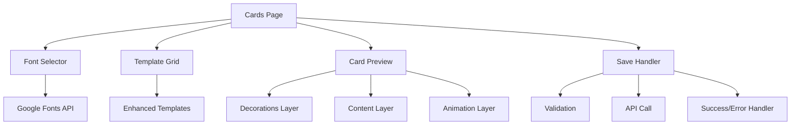

# Design Document

## Overview

تحسين شامل لنظام بطاقات عيد الميلاد يشمل:

- إضافة 8 خطوط عربية جميلة من Google Fonts
- تصميمات بطاقات جذابة مع زخارف متحركة
- إصلاح مشكلة الحفظ مع رسائل خطأ واضحة
- تصميمات داخلية غنية مع تأثيرات بصرية
- حركات وانتقالات سلسة

## Architecture



## Components and Interfaces

### 1. Font Configuration

```typescript
interface FontConfig {
  id: string;
  name: string;
  nameAr: string;
  family: string;
  weights: number[];
  preview: string;
}

const ARABIC_FONTS: FontConfig[] = [
  {
    id: 'cairo',
    name: 'Cairo',
    nameAr: 'القاهرة',
    family: 'Cairo',
    weights: [400, 600, 700],
    preview: 'عيد ميلاد سعيد',
  },
  {
    id: 'tajawal',
    name: 'Tajawal',
    nameAr: 'تجوال',
    family: 'Tajawal',
    weights: [400, 500, 700],
    preview: 'كل عام وأنت بخير',
  },
  {
    id: 'amiri',
    name: 'Amiri',
    nameAr: 'أميري',
    family: 'Amiri',
    weights: [400, 700],
    preview: 'أطيب التمنيات',
  },
  {
    id: 'almarai',
    name: 'Almarai',
    nameAr: 'المراعي',
    family: 'Almarai',
    weights: [400, 700, 800],
    preview: 'مبارك عليك',
  },
  {
    id: 'changa',
    name: 'Changa',
    nameAr: 'شانجا',
    family: 'Changa',
    weights: [400, 600, 700],
    preview: 'يوم سعيد',
  },
  {
    id: 'lateef',
    name: 'Lateef',
    nameAr: 'لطيف',
    family: 'Lateef',
    weights: [400, 700],
    preview: 'تهانينا',
  },
  {
    id: 'scheherazade',
    name: 'Scheherazade',
    nameAr: 'شهرزاد',
    family: 'Scheherazade New',
    weights: [400, 700],
    preview: 'أجمل الأمنيات',
  },
  {
    id: 'harmattan',
    name: 'Harmattan',
    nameAr: 'هرمتان',
    family: 'Harmattan',
    weights: [400, 600, 700],
    preview: 'عام جديد سعيد',
  },
];
```

### 2. Enhanced Template Structure

```typescript
interface EnhancedTemplate {
  id: string;
  name: string;
  nameAr: string;
  category: TemplateCategory;
  style: CardStyle;
  decorations: DecorationConfig;
  animations: AnimationConfig;
  defaultContent: DefaultContent;
}

interface DecorationConfig {
  type: 'balloons' | 'stars' | 'confetti' | 'hearts' | 'sparkles' | 'flowers';
  positions: Position[];
  colors: string[];
  animated: boolean;
}

interface AnimationConfig {
  entrance: 'fade' | 'slide' | 'scale' | 'bounce';
  textEffect: 'shimmer' | 'glow' | 'pulse' | 'none';
  decorationEffect: 'float' | 'pulse' | 'rotate' | 'bounce';
}
```

### 3. Card Preview Component

```typescript
interface CardPreviewProps {
  template: EnhancedTemplate;
  content: CardContent;
  font: FontConfig;
  showDecorations: boolean;
}
```

## Data Models

### Card Data

```typescript
interface CardData {
  name: string;
  age?: number;
  templateId: string;
  fontId: string;
  greeting: string;
  message: string;
  signature: string;
  showAge: boolean;
  showDecorations: boolean;
}
```

### Save Response

```typescript
interface SaveResponse {
  success: boolean;
  cardId?: string;
  message: string;
  errors?: string[];
  fieldErrors?: Record<string, string>;
}
```

## Correctness Properties

_A property is a characteristic or behavior that should hold true across all valid executions of a system-essentially, a formal statement about what the system should do. Properties serve as the bridge between human-readable specifications and machine-verifiable correctness guarantees._

### Property 1: Font Configuration Completeness

_For any_ font configuration array, it should contain at least 8 fonts, each with a valid Arabic name, family, and preview text.
**Validates: Requirements 1.1, 1.4**

### Property 2: Font Application Consistency

_For any_ font selection, when applied to a card preview, all text elements should use the selected font family.
**Validates: Requirements 1.2**

### Property 3: Template Decoration Mapping

_For any_ template, the decorations configuration should match the template category (playful = balloons/confetti, elegant = sparkles/flowers, etc.).
**Validates: Requirements 2.1, 2.2**

### Property 4: Template Visual Properties

_For any_ template, it should have a gradient background, border styling, and shadow effects defined.
**Validates: Requirements 2.3, 2.4, 4.2**

### Property 5: Validation Error Specificity

_For any_ invalid card data, the validation function should return specific error messages for each invalid field.
**Validates: Requirements 3.1, 3.2**

### Property 6: Save Response Format

_For any_ save operation, the response should include success status, message, and either cardId (on success) or errors (on failure).
**Validates: Requirements 3.4, 3.5**

### Property 7: Card Content Elements

_For any_ card with age provided, the age should be displayed in a decorative badge element with proper styling.
**Validates: Requirements 4.1, 4.3**

### Property 8: Animation Configuration

_For any_ template, it should have animation configurations for entrance, text effects, and decoration effects.
**Validates: Requirements 5.3, 5.4**

## Error Handling

### Validation Errors

- Empty name: "يرجى إدخال اسم صاحب البطاقة"
- Short name: "يجب أن يكون الاسم أكثر من حرف واحد"
- Long name: "يجب أن يكون الاسم أقل من 50 حرف"
- Invalid age: "العمر يجب أن يكون رقم موجب"
- No template: "يرجى اختيار تصميم للبطاقة"

### API Errors

- Network error: "فشل الاتصال بالخادم، يرجى المحاولة مرة أخرى"
- Server error: "حدث خطأ في الخادم، يرجى المحاولة لاحقاً"
- Timeout: "انتهت مهلة الطلب، يرجى المحاولة مرة أخرى"

## Testing Strategy

### Unit Tests

- Test font configuration validity
- Test validation function with various inputs
- Test template decoration mapping

### Property-Based Tests

Using Vitest with fast-check library:

- Property 1: Font configuration completeness
- Property 2: Font application consistency
- Property 3: Template decoration mapping
- Property 4: Template visual properties
- Property 5: Validation error specificity
- Property 6: Save response format
- Property 7: Card content elements
- Property 8: Animation configuration

Each property test will run 100 iterations with randomly generated inputs.
