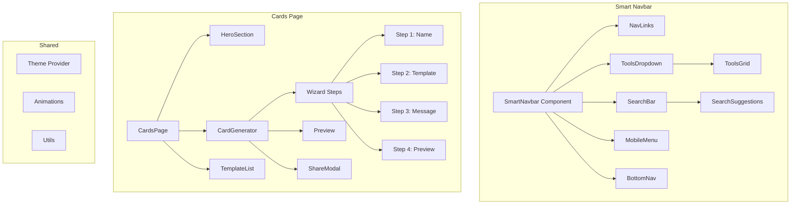

# Design Document: Smart Navbar & Enhanced Cards Page

## Overview

هذا التصميم يغطي تطوير نافبار ذكي متجاوب وصفحة بطاقات تهنئة محسنة لموقع ميلادك. الهدف هو تقديم تجربة مستخدم سلسة وجذابة على جميع الأجهزة.

## Architecture



## Components and Interfaces

### Smart Navbar Components

```typescript
// types/navbar.ts
interface NavItem {
  name: string;
  href: string;
  icon?: string;
  isPopular?: boolean;
}

interface ToolCategory {
  name: string;
  icon: string;
  tools: NavItem[];
}

interface SearchResult {
  type: 'tool' | 'article' | 'page';
  title: string;
  href: string;
  icon?: string;
}

interface SmartNavbarProps {
  className?: string;
}

interface ToolsDropdownProps {
  categories: ToolCategory[];
  isOpen: boolean;
  onClose: () => void;
}

interface SearchBarProps {
  onSearch: (query: string) => void;
  suggestions: SearchResult[];
  isExpanded: boolean;
  onToggle: () => void;
}

interface MobileMenuProps {
  isOpen: boolean;
  onClose: () => void;
  navItems: NavItem[];
  toolCategories: ToolCategory[];
}

interface BottomNavProps {
  activeItem: string;
}
```

### Cards Page Components

```typescript
// types/cards.ts
interface CardTemplate {
  id: string;
  name: string;
  category: 'classic' | 'modern' | 'fun' | 'elegant';
  preview: string;
  background: string;
  textColor: string;
  accentColor: string;
}

interface CardData {
  recipientName: string;
  age?: number;
  message: string;
  template: CardTemplate;
  customizations?: {
    fontSize?: number;
    fontFamily?: string;
  };
}

interface WizardStep {
  id: number;
  title: string;
  isComplete: boolean;
  isActive: boolean;
}

interface CardGeneratorProps {
  onComplete: (cardData: CardData) => void;
  initialData?: Partial<CardData>;
}

interface TemplateListProps {
  templates: CardTemplate[];
  selectedId: string;
  onSelect: (template: CardTemplate) => void;
  category?: string;
}

interface CardPreviewProps {
  cardData: CardData;
  zoomLevel: number;
  onZoomChange: (level: number) => void;
}

interface ShareModalProps {
  isOpen: boolean;
  onClose: () => void;
  cardData: CardData;
  cardImageUrl: string;
}
```

## Data Models

### Navbar Data

```typescript
const navigationItems: NavItem[] = [
  { name: 'الرئيسية', href: '/', icon: '🏠' },
  { name: 'الأدوات', href: '/tools', icon: '🛠️' },
  { name: 'البطاقات', href: '/cards', icon: '🎴' },
  { name: 'الأصدقاء', href: '/friends', icon: '👥' },
  { name: 'المقالات', href: '/articles', icon: '📰' },
];

const toolCategories: ToolCategory[] = [
  {
    name: 'حاسبات العمر',
    icon: '🎂',
    tools: [
      { name: 'حساب العمر', href: '/', isPopular: true },
      { name: 'العمر بالثواني', href: '/tools/age-in-seconds' },
      { name: 'العمر النسبي', href: '/tools/relative-age' },
    ],
  },
  {
    name: 'أدوات التاريخ',
    icon: '📅',
    tools: [
      { name: 'تحويل التاريخ', href: '/tools/date-converter', isPopular: true },
      { name: 'الأيام بين تاريخين', href: '/tools/days-between' },
      { name: 'يوم الأسبوع', href: '/tools/day-of-week' },
    ],
  },
  // ... more categories
];
```

### Card Templates Data

```typescript
const cardTemplates: CardTemplate[] = [
  {
    id: 'galaxy',
    name: 'المجرة',
    category: 'modern',
    preview: '/templates/galaxy-preview.png',
    background:
      'linear-gradient(135deg, #1a1a2e 0%, #16213e 50%, #0f3460 100%)',
    textColor: '#ffffff',
    accentColor: '#e94560',
  },
  {
    id: 'confetti',
    name: 'الاحتفال',
    category: 'fun',
    preview: '/templates/confetti-preview.png',
    background: 'linear-gradient(135deg, #ff9a9e 0%, #fecfef 100%)',
    textColor: '#333333',
    accentColor: '#ff6b6b',
  },
  // ... 6+ more templates
];
```

## Correctness Properties

_A property is a characteristic or behavior that should hold true across all valid executions of a system-essentially, a formal statement about what the system should do. Properties serve as the bridge between human-readable specifications and machine-verifiable correctness guarantees._

### Property 1: Scroll State Consistency

_For any_ scroll position, the navbar compact state should be true if and only if the scroll position is greater than the threshold value (e.g., 100px).
**Validates: Requirements 1.2, 1.3**

### Property 2: Navigation Items Completeness

_For any_ navbar state (compact or expanded), all navigation items should remain present and functional with valid href attributes.
**Validates: Requirements 1.4, 1.5**

### Property 3: Tools Dropdown Content Integrity

_For any_ tool displayed in the dropdown, the tool should have both an icon and a name, and the href should be a valid internal route.
**Validates: Requirements 2.2, 2.3**

### Property 4: Mobile Touch Target Accessibility

_For any_ interactive element in the mobile menu, the touch target size should be at least 44x44 pixels.
**Validates: Requirements 3.3**

### Property 5: Search Results Categorization

_For any_ search result returned, the result should have a valid type from the set {tool, article, page} and contain title and href.
**Validates: Requirements 4.2, 4.3**

### Property 6: Card Input Validation

_For any_ recipient name input, the validation should correctly identify empty strings and strings exceeding maximum length as invalid.
**Validates: Requirements 6.2**

### Property 7: Template Selection Preview Sync

_For any_ template selection, the preview should update to reflect the selected template's styling within the same render cycle.
**Validates: Requirements 6.3**

### Property 8: Form Completion Button State

_For any_ combination of form field values, the generate button should be enabled if and only if all required fields (name, template, message) are valid.
**Validates: Requirements 6.5**

### Property 9: Template Count Minimum

_For any_ render of the template list, the number of available templates should be at least 8.
**Validates: Requirements 10.1**

### Property 10: Template Category Validity

_For any_ template in the template list, the category should be one of: classic, modern, fun, elegant.
**Validates: Requirements 10.3**

## Error Handling

### Navbar Errors

- **Search API Failure**: Display "حدث خطأ في البحث" message and allow retry
- **Navigation Failure**: Log error and provide fallback navigation
- **Theme Switch Failure**: Maintain current theme and show error toast

### Cards Page Errors

- **Template Load Failure**: Show placeholder templates with retry option
- **Image Generation Failure**: Display error message with retry button
- **Share API Failure**: Provide fallback copy-to-clipboard option
- **Download Failure**: Show error toast with troubleshooting tips

## Testing Strategy

### Unit Testing

- Test individual component rendering
- Test state management hooks
- Test utility functions for validation and formatting

### Property-Based Testing

Using `fast-check` library for property-based tests:

- **Navbar scroll behavior**: Generate random scroll positions and verify state consistency
- **Search categorization**: Generate random search results and verify categorization
- **Form validation**: Generate random input combinations and verify validation logic
- **Template data integrity**: Verify all templates have required properties

### Integration Testing

- Test navbar interaction with page navigation
- Test card generator wizard flow
- Test share functionality with mock APIs

### Test Configuration

- Minimum 100 iterations per property test
- Each property test tagged with format: `**Feature: smart-navbar-enhanced-cards, Property {number}: {property_text}**`
