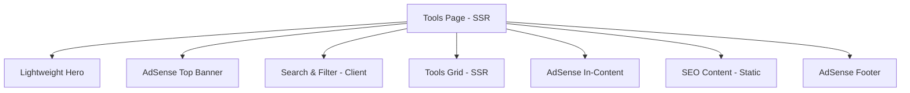

# Design Document: Tools Page Beautification

## Overview

تحسين وتجميل صفحة الأدوات في موقع ميلادك مع التركيز الأساسي على **السرعة والخفة** ومناسبة **AdSense**. التصميم يعتمد على CSS فقط للتأثيرات البصرية، بدون مكتبات أنيميشن ثقيلة، مع مساحات مخصصة للإعلانات.

### Design Principles

1. **🚀 Speed First**: لا framer-motion، لا مكتبات ثقيلة، CSS فقط
2. **💰 AdSense Ready**: مساحات إعلانية محددة بأحجام قياسية
3. **📱 Lightweight**: حجم JavaScript أقل من 50KB للمكون
4. **⚡ Instant Load**: Server-side rendering للمحتوى الأساسي
5. **🎯 Core Web Vitals**: LCP < 2.5s, FID < 100ms, CLS < 0.1

## Architecture



### Performance Budget

| Metric                   | Target |
| ------------------------ | ------ |
| JavaScript Bundle        | < 50KB |
| First Contentful Paint   | < 1.5s |
| Largest Contentful Paint | < 2.5s |
| Cumulative Layout Shift  | < 0.1  |
| Time to Interactive      | < 3s   |

### AdSense Placement Strategy

```
┌─────────────────────────────────────┐
│         Hero Section (Light)         │
├─────────────────────────────────────┤
│    🎯 AdSense Top Banner (728x90)   │
├─────────────────────────────────────┤
│      Search & Category Filter        │
├─────────────────────────────────────┤
│  Tool Cards Row 1 (3 cards)          │
│  Tool Cards Row 2 (3 cards)          │
├─────────────────────────────────────┤
│  🎯 AdSense In-Content (336x280)    │
├─────────────────────────────────────┤
│  Tool Cards Row 3+ (remaining)       │
├─────────────────────────────────────┤
│      SEO Content Section             │
├─────────────────────────────────────┤
│   🎯 AdSense Footer (728x90)        │
└─────────────────────────────────────┘
```

## Components and Interfaces

### 1. Lightweight Hero Section (No Animation Library)

```typescript
// بدون framer-motion - CSS فقط
interface LightHeroProps {
  toolsCount: number;
  categoriesCount: number;
}

// CSS Classes - خفيفة وسريعة
const heroClasses = {
  container: 'text-center py-8 md:py-12',
  title: 'text-3xl md:text-4xl font-bold mb-4 gradient-text',
  subtitle: 'text-lg text-gray-600 dark:text-gray-400 max-w-2xl mx-auto mb-6',
  stats: 'flex justify-center gap-6 flex-wrap',
  statItem: 'text-center px-4',
  statNumber: 'text-2xl font-bold text-purple-600',
  statLabel: 'text-sm text-gray-500',
};
```

### 2. Optimized Tool Card (Pure CSS)

```typescript
interface ToolCardProps {
  tool: Tool;
  featured?: boolean;
}

// CSS-only hover effects - no JavaScript animations
const cardStyles = `
  .tool-card {
    @apply bg-white dark:bg-gray-800 rounded-xl p-4 border border-gray-200 dark:border-gray-700;
    @apply transition-shadow duration-200;
  }
  .tool-card:hover {
    @apply shadow-lg;
  }
  .tool-card-icon {
    @apply w-12 h-12 rounded-lg flex items-center justify-center text-xl;
  }
  .tool-card-featured {
    @apply ring-2 ring-purple-400;
  }
`;
```

### 3. Simple Category Filter

```typescript
interface CategoryFilterProps {
  categories: ToolCategory[];
  selected: string | null;
  onSelect: (id: string | null) => void;
}

// Minimal CSS
const filterStyles = `
  .category-btn {
    @apply px-4 py-2 rounded-full text-sm font-medium;
    @apply bg-gray-100 dark:bg-gray-800;
    @apply hover:bg-gray-200 dark:hover:bg-gray-700;
    @apply transition-colors duration-150;
  }
  .category-btn-active {
    @apply bg-purple-600 text-white;
  }
`;
```

### 4. AdSense Integration Points

```typescript
// مواقع الإعلانات المحددة
const adPlacements = {
  topBanner: {
    slot: 'top-banner',
    format: 'horizontal',
    size: '728x90',
    responsive: true,
  },
  inContent: {
    slot: 'in-content',
    format: 'rectangle',
    size: '336x280',
    insertAfterTools: 6, // بعد 6 أدوات
  },
  footer: {
    slot: 'footer',
    format: 'horizontal',
    size: '728x90',
  },
};
```

## Data Models

### Tool Interface (Existing)

```typescript
interface Tool {
  id: number;
  slug: string;
  name: string;
  title?: string;
  description: string;
  icon: string;
  category_id: number;
  category_name?: string;
  href?: string;
  featured: boolean;
  active: boolean;
}
```

### ToolCategory Interface (Existing)

```typescript
interface ToolCategory {
  id: number;
  name: string;
  slug: string;
  title?: string;
  icon?: string;
  sort_order: number;
  tools_count?: number;
}
```

## Performance Optimizations

### 1. Remove Heavy Dependencies

```typescript
// ❌ قبل - ثقيل
import { motion } from 'framer-motion';

// ✅ بعد - خفيف
// CSS transitions فقط
```

### 2. CSS-Only Animations

```css
/* تأثيرات خفيفة بدون JavaScript */
.fade-in {
  animation: fadeIn 0.3s ease-out;
}

@keyframes fadeIn {
  from {
    opacity: 0;
  }
  to {
    opacity: 1;
  }
}

/* Hover effects */
.hover-lift {
  transition: transform 0.2s, box-shadow 0.2s;
}
.hover-lift:hover {
  transform: translateY(-2px);
  box-shadow: 0 4px 12px rgba(0, 0, 0, 0.1);
}

/* Reduced motion support */
@media (prefers-reduced-motion: reduce) {
  *,
  *::before,
  *::after {
    animation-duration: 0.01ms !important;
    transition-duration: 0.01ms !important;
  }
}
```

### 3. Lazy Loading Strategy

```typescript
// تحميل الإعلانات بعد المحتوى الأساسي
const AdSenseSlot = dynamic(() => import('@/components/AdSense/AdSenseSlot'), {
  ssr: false,
  loading: () => <div className="ad-placeholder h-[90px]" />,
});
```

## Correctness Properties

_A property is a characteristic or behavior that should hold true across all valid executions of a system-essentially, a formal statement about what the system should do. Properties serve as the bridge between human-readable specifications and machine-verifiable correctness guarantees._

### Property 1: Reduced Motion Preference Respected

_For any_ user with reduced motion preferences enabled, _all_ CSS animations should have duration of 0.01ms or less.
**Validates: Requirements 1.5**

### Property 2: Tool Icon Gradient Matches Category

_For any_ tool displayed in a Tool_Card, the icon container should have a gradient class corresponding to the tool's category.
**Validates: Requirements 2.3**

### Property 3: Featured Tools Display Special Styling

_For any_ tool marked as featured (tool.featured === true), the Tool_Card should have the featured ring class.
**Validates: Requirements 2.6**

### Property 4: Category Selection Filters Tools

_For any_ category selection, the filtered tools should only include tools from that category.
**Validates: Requirements 3.2, 3.4**

### Property 5: Category Buttons Show Counts

_For any_ category in the filter, the button should display the tool count.
**Validates: Requirements 3.3, 3.5**

### Property 6: Search Filters Tools Correctly

_For any_ search query, filtered tools should match the query in name or description.
**Validates: Requirements 4.2**

### Property 7: Empty Search Shows Message

_For any_ search with zero results, an empty state message should display.
**Validates: Requirements 4.4**

### Property 8: Clear Search Shows All Tools

_For any_ cleared search, all tools should be visible.
**Validates: Requirements 4.5**

### Property 9: No External Image Icons

_For any_ tool icon, it should be SVG or emoji, not an external image file.
**Validates: Requirements 5.4**

### Property 10: SEO Section Uses Semantic Headings

_For any_ SEO section, headings should follow h2 > h3 hierarchy.
**Validates: Requirements 8.3**

## Error Handling

### Loading States

- Skeleton placeholders with fixed dimensions (prevent CLS)
- No spinners - instant content preferred

### Empty States

- Simple text message with reset button
- No complex animations

### Error States

- Static error message
- Retry button

## Testing Strategy

### Unit Testing

- Component rendering
- CSS class application
- Filter/search logic

### Property-Based Testing

Using **fast-check** library:

```typescript
import fc from 'fast-check';

describe('Tools Page Properties', () => {
  // Property 4: Category filtering
  it('filters tools by category correctly', () => {
    fc.assert(
      fc.property(
        fc.array(toolArbitrary),
        fc.integer({ min: 1, max: 10 }),
        (tools, categoryId) => {
          const filtered = filterToolsByCategory(tools, categoryId);
          return filtered.every((tool) => tool.category_id === categoryId);
        }
      ),
      { numRuns: 100 }
    );
  });

  // Property 6: Search filtering
  it('filters tools by search query correctly', () => {
    fc.assert(
      fc.property(
        fc.array(toolArbitrary),
        fc.string({ minLength: 1, maxLength: 20 }),
        (tools, query) => {
          const filtered = filterToolsBySearch(tools, query);
          return filtered.every(
            (tool) =>
              tool.name.toLowerCase().includes(query.toLowerCase()) ||
              tool.description.toLowerCase().includes(query.toLowerCase())
          );
        }
      ),
      { numRuns: 100 }
    );
  });
});
```

### Performance Testing

- Lighthouse CI for Core Web Vitals
- Bundle size monitoring
- No framer-motion in bundle
