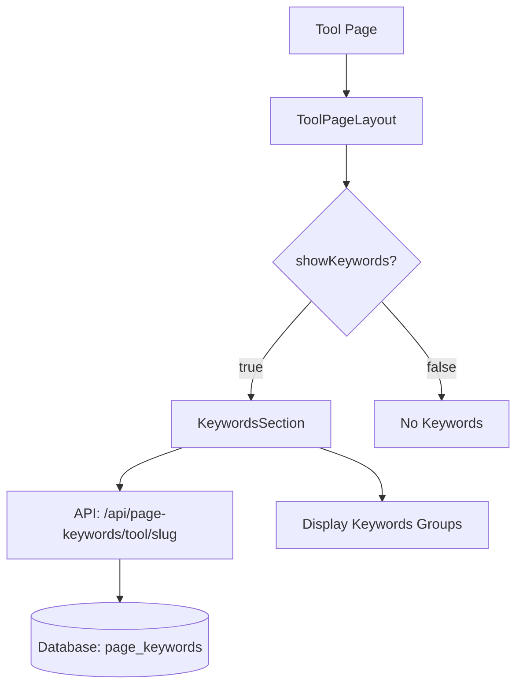

# Design Document: Tools Keywords Propagation

## Overview

هذا التصميم يوضح كيفية نقل مكون الكلمات المفتاحية (KeywordsSection) إلى جميع صفحات الأدوات في موقع ميلادك. الهدف هو تفعيل عرض الكلمات المفتاحية المجلوبة من قاعدة البيانات في 18 صفحة أداة عبر إضافة خاصية `showKeywords={true}` لمكون `ToolPageLayout`.

## Architecture



## Components and Interfaces

### Existing Components (No Changes Required)

1. **ToolPageLayout** (`components/tools/ToolPageLayout.tsx`)

   - Already supports `showKeywords` prop
   - Lazy loads KeywordsSection when `showKeywords={true}`
   - Passes `toolSlug` and `pageType="tool"` to KeywordsSection

2. **KeywordsSection** (`components/tools/KeywordsSection.tsx`)

   - Fetches keywords from `/api/page-keywords/{pageType}/{toolSlug}`
   - Displays keywords in categorized groups
   - Falls back to default keywords if database returns empty

3. **API Route** (`app/api/page-keywords/[type]/[slug]/route.ts`)
   - Returns keywords array for the specified page type and slug
   - Queries `page_keywords` table in database

### Tool Pages to Update

Each tool page needs one change: add `showKeywords={true}` to the ToolPageLayout component.

```tsx
// Before
<ToolPageLayout
  toolName="..."
  toolSlug="..."
  toolDescription="..."
  // ... other props
>

// After
<ToolPageLayout
  toolName="..."
  toolSlug="..."
  toolDescription="..."
  showKeywords={true}  // Add this line
  // ... other props
>
```

## Data Models

### Existing Database Schema (page_keywords table)

```sql
CREATE TABLE page_keywords (
  id INTEGER PRIMARY KEY AUTOINCREMENT,
  page_type TEXT NOT NULL,      -- 'tool', 'article', 'page'
  page_slug TEXT NOT NULL,      -- e.g., 'bmi-calculator'
  keywords TEXT NOT NULL,       -- JSON array of keywords
  created_at DATETIME DEFAULT CURRENT_TIMESTAMP,
  updated_at DATETIME DEFAULT CURRENT_TIMESTAMP
);
```

### API Response Format

```typescript
interface KeywordsResponse {
  keywords: string[]; // Array of 120 keywords (6 groups × 20 keywords)
}
```

## Correctness Properties

_A property is a characteristic or behavior that should hold true across all valid executions of a system-essentially, a formal statement about what the system should do. Properties serve as the bridge between human-readable specifications and machine-verifiable correctness guarantees._

### Property 1: Keywords Section Renders on All Tool Pages

_For any_ tool page with `showKeywords={true}`, the KeywordsSection component SHALL be rendered in the page DOM.
**Validates: Requirements 1.1, 2.2**

### Property 2: API Fetch Uses Correct Tool Slug

_For any_ tool page, when KeywordsSection renders, it SHALL call the API with the correct toolSlug parameter matching the page's slug.
**Validates: Requirements 1.2, 2.3**

### Property 3: Keywords Display in Categorized Groups

_For any_ non-empty keywords array returned from the API, the KeywordsSection SHALL display all keywords organized into categorized groups.
**Validates: Requirements 1.3**

### Property 4: Keyword Click Navigates to Search

_For any_ keyword displayed in the KeywordsSection, clicking it SHALL navigate to `/search?q={keyword}` with the keyword URL-encoded.
**Validates: Requirements 3.2**

## Error Handling

1. **API Fetch Failure**: KeywordsSection displays default keyword groups
2. **Empty Keywords Array**: KeywordsSection displays default keyword groups
3. **Network Timeout**: Loading indicator shown, then falls back to defaults

## Testing Strategy

### Unit Tests

- Verify ToolPageLayout renders KeywordsSection when `showKeywords={true}`
- Verify ToolPageLayout does NOT render KeywordsSection when `showKeywords={false}`

### Property-Based Tests

Using `fast-check` library for property-based testing:

1. **Property 1 Test**: Generate random tool slugs, verify KeywordsSection renders
2. **Property 2 Test**: Generate random tool slugs, verify API called with correct slug
3. **Property 3 Test**: Generate random keyword arrays, verify all display correctly
4. **Property 4 Test**: Generate random keywords, verify search URL is correct

### Integration Tests

- Test full flow from page load to keywords display
- Test fallback behavior when API returns empty

## Implementation Notes

1. **No Component Changes**: All existing components work correctly
2. **Simple Update**: Only add `showKeywords={true}` to each tool page
3. **Database Dependency**: Keywords must exist in `page_keywords` table for each tool
4. **Lazy Loading**: KeywordsSection is lazy-loaded for performance
