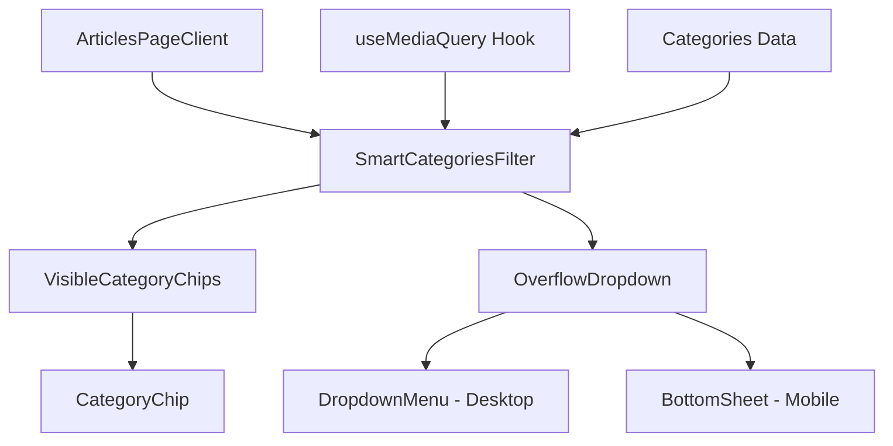

# Design Document

## Overview

تصميم نظام عرض ذكي للتصنيفات في صفحة المقالات يعرض التصنيفات الأكثر أهمية بشكل مباشر مع إمكانية الوصول لباقي التصنيفات عبر قائمة منسدلة. النظام يتجاوب مع أحجام الشاشات المختلفة ويوفر تجربة مستخدم سلسة.

## Architecture



## Components and Interfaces

### SmartCategoriesFilter Component

```typescript
interface SmartCategoriesFilterProps {
  categories: CategoryWithCount[];
  selectedCategory: string | null;
  onCategorySelect: (categoryId: string | null) => void;
  totalArticles: number;
}

interface CategoryWithCount {
  id: number;
  name: string;
  slug: string;
  color: string;
  articles_count: number;
}
```

### Component Structure

1. **SmartCategoriesFilter**: المكون الرئيسي الذي يدير عرض التصنيفات
2. **CategoryChip**: زر تصنيف واحد مع badge لعدد المقالات
3. **OverflowDropdown**: قائمة منسدلة للتصنيفات الإضافية
4. **MobileBottomSheet**: bottom sheet للموبايل

## Data Models

```typescript
// التصنيفات المرتبة حسب عدد المقالات
type SortedCategories = CategoryWithCount[];

// حالة العرض
interface DisplayState {
  visibleCategories: CategoryWithCount[];
  overflowCategories: CategoryWithCount[];
  isDropdownOpen: boolean;
  visibleCount: number; // 3 للموبايل، 5 للديسكتوب
}
```

## Correctness Properties

_A property is a characteristic or behavior that should hold true across all valid executions of a system-essentially, a formal statement about what the system should do. Properties serve as the bridge between human-readable specifications and machine-verifiable correctness guarantees._

### Property 1: Top categories by article count

_For any_ set of categories with article counts, the visible categories should be the ones with the highest article counts, sorted in descending order.
**Validates: Requirements 1.1**

### Property 2: Zero-count categories exclusion

_For any_ set of categories, categories with zero articles should never appear in the visible chips list.
**Validates: Requirements 1.3, 4.2**

### Property 3: Responsive visible count

_For any_ viewport width, if width < 768px then visibleCount should be 3, otherwise visibleCount should be 5.
**Validates: Requirements 2.1, 2.2**

### Property 4: Category filtering correctness

_For any_ selected category, the filtered articles should only contain articles belonging to that category.
**Validates: Requirements 3.2**

### Property 5: All articles filter reset

_For any_ state where a category is selected, selecting "جميع المقالات" should result in no category filter being applied.
**Validates: Requirements 5.3**

## Error Handling

1. **Empty Categories**: إذا لم توجد تصنيفات، يُعرض رسالة "لا توجد تصنيفات"
2. **API Errors**: في حالة فشل جلب التصنيفات، يُعرض التصنيفات المحملة مسبقاً
3. **Invalid Selection**: إذا تم اختيار تصنيف غير موجود، يُعاد للحالة الافتراضية

## Testing Strategy

### Unit Tests

- اختبار ترتيب التصنيفات حسب عدد المقالات
- اختبار استبعاد التصنيفات الفارغة
- اختبار منطق العرض المتجاوب

### Property-Based Tests

- استخدام مكتبة `fast-check` للاختبارات
- كل اختبار يجب أن يعمل 100 مرة على الأقل
- تنسيق التعليقات: `**Feature: smart-articles-categories-display, Property {number}: {property_text}**`

### Test Cases

1. التحقق من أن أعلى N تصنيفات تظهر بشكل صحيح
2. التحقق من إخفاء التصنيفات بدون مقالات
3. التحقق من تغيير عدد التصنيفات المرئية حسب حجم الشاشة
4. التحقق من صحة فلترة المقالات عند اختيار تصنيف
