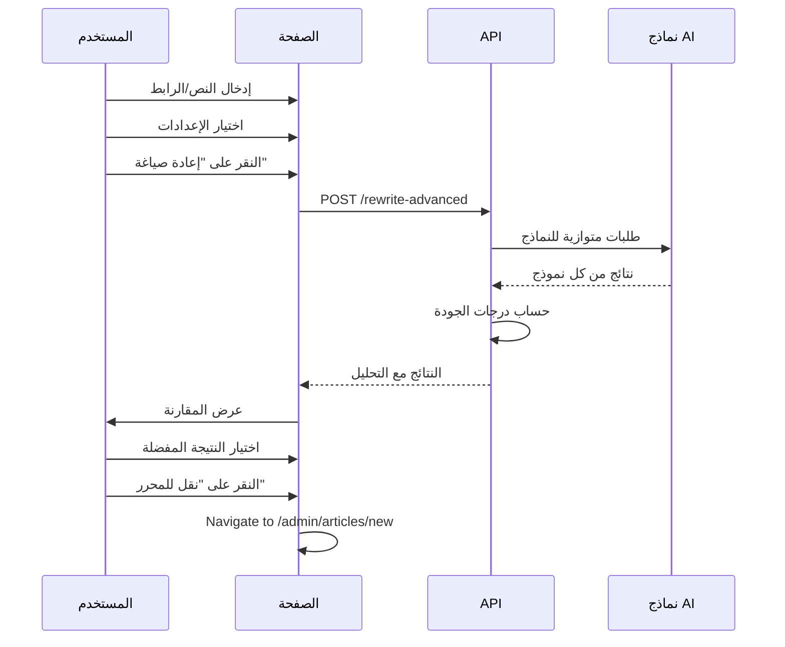

# Design Document: نظام إعادة الصياغة المتقدم

## Overview

نظام إعادة الصياغة المتقدم هو أداة شاملة في لوحة التحكم تمكّن المستخدم من إعادة صياغة المحتوى باستخدام نماذج AI متعددة. يدعم النظام إدخال النص مباشرة أو استخلاصه من روابط خارجية، مع إمكانية توليد صور تلقائية ونقل النتائج إلى صفحة إنشاء المقالات.

## Architecture

```mermaid
flowchart TD
    subgraph UI["واجهة المستخدم"]
        A[صفحة إعادة الصياغة] --> B{نوع المدخل}
        B -->|نص مباشر| C[TextRewriter Component]
        B -->|رابط| D[UrlRewriter Component]
    end

    subgraph API["طبقة API"]
        E[/api/admin/ai/rewrite-advanced]
        F[/api/admin/ai/extract-content]
        G[/api/admin/ai/generate-images]
    end

    subgraph Services["طبقة الخدمات"]
        H[ContentExtractor Service]
        I[MultiModelRewriter Service]
        J[ImageGenerator Service]
        K[QualityAnalyzer Service]
    end

    subgraph Providers["مزودي AI"]
        L[Gemini]
        M[Groq]
        N[Cohere]
        O[HuggingFace]
        P[Local/SONA]
    end

    C --> E
    D --> F
    F --> H
    E --> I
    I --> L & M & N & O & P
    E --> G
    G --> J
    E --> K
```

## Components and Interfaces

### 1. صفحة إعادة الصياغة الرئيسية

```typescript
// app/admin/rewriter/page.tsx
interface RewriterPageProps {}

// الصفحة تحتوي على:
// - Tabs للتبديل بين (نص مباشر / رابط / السجل)
// - إعدادات مشتركة (النماذج، عدد الكلمات، النمط)
// - منطقة عرض النتائج
```

### 2. مكون إعادة الصياغة من النص

```typescript
// components/admin/rewriter/TextRewriter.tsx
interface TextRewriterProps {
  onResult: (results: RewriteResult[]) => void;
  onTransfer: (result: RewriteResult) => void;
}

interface RewriteSettings {
  models: AIProvider[]; // النماذج المختارة
  wordCount: number; // عدد الكلمات المطلوب
  style: WritingStyle; // نمط الكتابة
  audience: TargetAudience; // الجمهور المستهدف
  generateImages: boolean; // توليد صور
  imageCount: number; // عدد الصور
  imageStyle: ImageStyle; // نمط الصور
}

type WritingStyle = 'formal' | 'informal' | 'academic' | 'journalistic';
type TargetAudience = 'general' | 'expert' | 'children' | 'youth';
type ImageStyle = 'realistic' | 'illustration' | 'diagram';
```

### 3. مكون إعادة الصياغة من الرابط

```typescript
// components/admin/rewriter/UrlRewriter.tsx
interface UrlRewriterProps {
  onResult: (results: RewriteResult[]) => void;
  onTransfer: (result: RewriteResult) => void;
}

interface ExtractedContent {
  title: string;
  content: string;
  cleanContent: string;
  author?: string;
  publishDate?: string;
  images: string[];
  metadata: {
    description?: string;
    keywords?: string[];
    language?: string;
    wordCount: number;
  };
}
```

### 4. مكون مقارنة النتائج

```typescript
// components/admin/rewriter/ResultsComparison.tsx
interface ResultsComparisonProps {
  results: RewriteResult[];
  originalContent: string;
  onSelectResult: (result: RewriteResult) => void;
  onTransferToEditor: (result: RewriteResult) => void;
}

interface RewriteResult {
  id: string;
  model: AIProvider;
  title: string;
  content: string;
  wordCount: number;
  qualityScore: number;
  readabilityScore: number;
  seoScore: number;
  uniquenessScore: number;
  keywords: string[];
  metaDescription: string;
  suggestedTitles: string[];
  generationTime: number;
}
```

### 5. مكون توليد الصور

```typescript
// components/admin/rewriter/ImageGenerator.tsx
interface ImageGeneratorProps {
  content: string;
  count: number;
  style: ImageStyle;
  onImagesGenerated: (images: GeneratedImage[]) => void;
}

interface GeneratedImage {
  id: string;
  url: string;
  thumbnailUrl: string;
  alt: string;
  caption: string;
  width: number;
  height: number;
  fileSize: number;
}
```

## Data Models

### جدول سجل إعادة الصياغة

```sql
CREATE TABLE IF NOT EXISTS rewrite_history (
  id INTEGER PRIMARY KEY AUTOINCREMENT,
  source_type TEXT NOT NULL CHECK(source_type IN ('text', 'url')),
  source_url TEXT,
  original_title TEXT,
  original_content TEXT NOT NULL,
  settings TEXT NOT NULL, -- JSON: {models, wordCount, style, audience}
  results TEXT NOT NULL, -- JSON: array of RewriteResult
  images TEXT, -- JSON: array of GeneratedImage
  created_at DATETIME DEFAULT CURRENT_TIMESTAMP,
  updated_at DATETIME DEFAULT CURRENT_TIMESTAMP
);

CREATE INDEX idx_rewrite_history_created ON rewrite_history(created_at DESC);
CREATE INDEX idx_rewrite_history_source ON rewrite_history(source_type);
```

### أنواع TypeScript للبيانات

```typescript
// types/rewriter.ts
export interface RewriteHistoryRecord {
  id: number;
  sourceType: 'text' | 'url';
  sourceUrl?: string;
  originalTitle: string;
  originalContent: string;
  settings: RewriteSettings;
  results: RewriteResult[];
  images?: GeneratedImage[];
  createdAt: string;
  updatedAt: string;
}

export interface RewriteRequest {
  title: string;
  content: string;
  models: AIProvider[];
  wordCount: number;
  style: WritingStyle;
  audience: TargetAudience;
  generateImages: boolean;
  imageCount?: number;
  imageStyle?: ImageStyle;
}

export interface RewriteResponse {
  success: boolean;
  results: RewriteResult[];
  images?: GeneratedImage[];
  originalAnalysis: {
    wordCount: number;
    readability: number;
    topics: string[];
  };
  error?: string;
}
```

## API Endpoints

### 1. إعادة الصياغة المتقدمة

```typescript
// POST /api/admin/ai/rewrite-advanced
// Request Body: RewriteRequest
// Response: RewriteResponse

// يقوم بـ:
// 1. معالجة المحتوى الأصلي
// 2. إرسال طلبات متوازية لجميع النماذج المختارة
// 3. حساب درجات الجودة لكل نتيجة
// 4. توليد الصور إذا طُلب ذلك
// 5. حفظ العملية في السجل
```

### 2. استخلاص المحتوى من الرابط

```typescript
// POST /api/admin/ai/extract-content
interface ExtractRequest {
  url: string;
  cleanAds: boolean;
  extractImages: boolean;
  extractMetadata: boolean;
}

// Response: ExtractedContent
// يستخدم cheerio و @mozilla/readability لاستخلاص المحتوى
```

### 3. توليد الصور

```typescript
// POST /api/admin/ai/generate-images
interface GenerateImagesRequest {
  content: string;
  count: number;
  style: ImageStyle;
  addArabicText?: boolean;
}

// Response: { images: GeneratedImage[] }
// يستخدم Pexels API الموجود + معالجة الصور
```

## Services Implementation

### 1. خدمة استخلاص المحتوى

```typescript
// lib/services/contentExtractor.ts
export class ContentExtractor {
  async extractFromUrl(url: string): Promise<ExtractedContent> {
    // 1. جلب HTML من الرابط
    // 2. تنظيف المحتوى باستخدام cheerio
    // 3. استخراج النص الرئيسي باستخدام Readability
    // 4. استخراج البيانات الوصفية
    // 5. إرجاع المحتوى المنظف
  }

  private cleanHtml(html: string): string {
    // إزالة الإعلانات والعناصر غير المرغوبة
  }

  private extractMetadata($: CheerioAPI): ContentMetadata {
    // استخراج العنوان، الوصف، الكلمات المفتاحية
  }
}
```

### 2. خدمة إعادة الصياغة المتعددة

```typescript
// lib/services/multiModelRewriter.ts
export class MultiModelRewriter {
  async rewriteWithModels(
    content: string,
    models: AIProvider[],
    options: RewriteOptions
  ): Promise<RewriteResult[]> {
    // إرسال طلبات متوازية لجميع النماذج
    const promises = models.map((model) =>
      this.rewriteWithModel(content, model, options)
    );

    const results = await Promise.allSettled(promises);
    return this.processResults(results);
  }

  private buildPrompt(content: string, options: RewriteOptions): string {
    // بناء prompt مخصص حسب النمط والجمهور
  }

  private async analyzeQuality(
    original: string,
    rewritten: string
  ): Promise<QualityMetrics> {
    // حساب درجات الجودة والتفرد
  }
}
```

### 3. خدمة تحليل الجودة

```typescript
// lib/services/qualityAnalyzer.ts
export class QualityAnalyzer {
  calculateReadability(content: string): number {
    // حساب قابلية القراءة للنص العربي
  }

  calculateUniqueness(original: string, rewritten: string): number {
    // حساب نسبة التفرد
  }

  calculateSEOScore(content: string, keywords: string[]): number {
    // حساب درجة SEO
  }

  getSuggestions(metrics: QualityMetrics): string[] {
    // اقتراحات لتحسين المحتوى
  }
}
```

## Error Handling

### استراتيجية معالجة الأخطاء

```typescript
// أنواع الأخطاء
enum RewriterErrorType {
  EXTRACTION_FAILED = 'EXTRACTION_FAILED',
  MODEL_UNAVAILABLE = 'MODEL_UNAVAILABLE',
  RATE_LIMITED = 'RATE_LIMITED',
  CONTENT_TOO_LONG = 'CONTENT_TOO_LONG',
  INVALID_URL = 'INVALID_URL',
  NETWORK_ERROR = 'NETWORK_ERROR',
}

// معالجة الأخطاء
class RewriterError extends Error {
  constructor(
    public type: RewriterErrorType,
    public message: string,
    public details?: any
  ) {
    super(message);
  }
}

// Fallback للنماذج
// إذا فشل نموذج، يستمر مع الباقي ويُرجع النتائج الناجحة
```

## Testing Strategy

### اختبارات الوحدة

```typescript
// __tests__/services/contentExtractor.test.ts
describe('ContentExtractor', () => {
  it('should extract content from valid URL');
  it('should handle invalid URLs gracefully');
  it('should remove ads and navigation');
  it('should extract metadata correctly');
});

// __tests__/services/multiModelRewriter.test.ts
describe('MultiModelRewriter', () => {
  it('should rewrite with multiple models in parallel');
  it('should handle model failures gracefully');
  it('should calculate quality scores');
});
```

### اختبارات التكامل

```typescript
// __tests__/api/rewrite-advanced.test.ts
describe('POST /api/admin/ai/rewrite-advanced', () => {
  it('should rewrite text content');
  it('should handle multiple models');
  it('should generate images when requested');
  it('should save to history');
});
```

## UI/UX Flow



## Dependencies

### مكتبات جديدة مطلوبة

```json
{
  "cheerio": "^1.0.0-rc.12",
  "@mozilla/readability": "^0.5.0"
}
```

### المكتبات الموجودة المستخدمة

- `lib/ai/generator.ts` - مولد AI الرئيسي
- `lib/ai/providers/*` - مزودي AI
- `lib/images/pexels.ts` - توليد الصور
- `lib/db/*` - قاعدة البيانات

## Security Considerations

1. التحقق من صحة الروابط قبل الاستخلاص
2. تحديد حد أقصى لحجم المحتوى (50,000 حرف)
3. تنظيف المحتوى من السكريبتات الضارة
4. Rate limiting للطلبات
5. تسجيل العمليات للمراجعة
